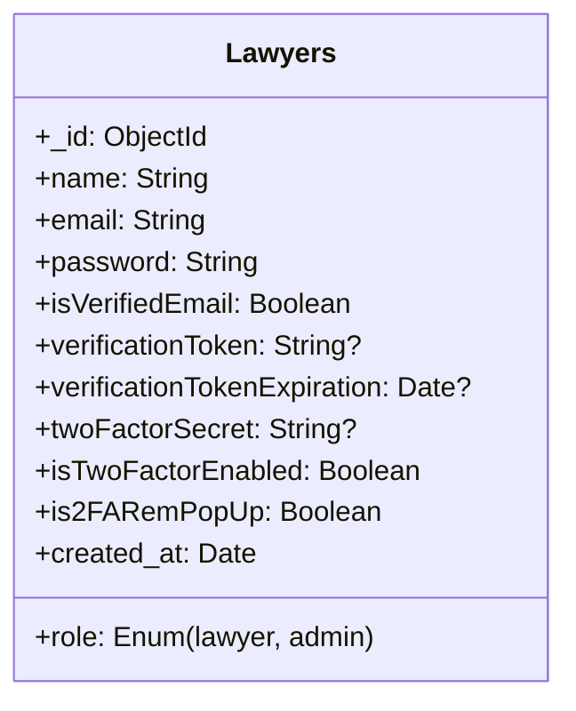

# Database Schema

## Collections

### `lawyers`

```mermaid
classDiagram
    class Lawyers {
        +_id: ObjectId
        +name: String
        +email: String
        +password: String
        +role: Enum(lawyer, admin)
        +isVerifiedEmail: Boolean
        +verificationToken: String?
        +verificationTokenExpiration: Date?
        +twoFactorSecret: String?
        +isTwoFactorEnabled: Boolean
        +is2FARemPopUp: Boolean
        +created_at: Date
    }
```

## Indexes
- `email`: Unique
